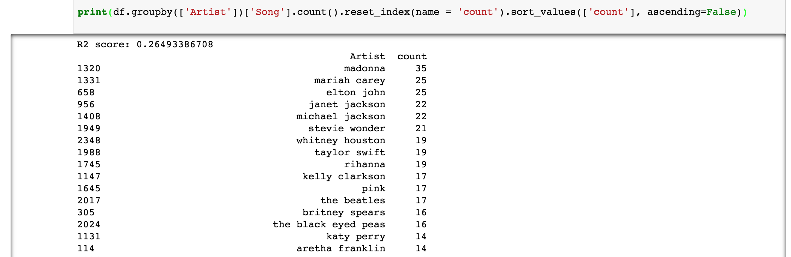
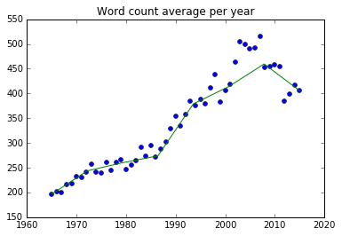
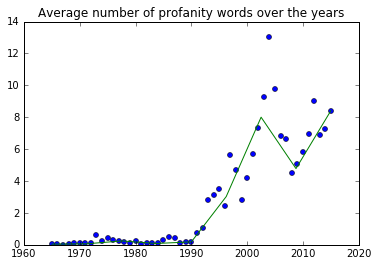
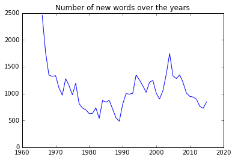
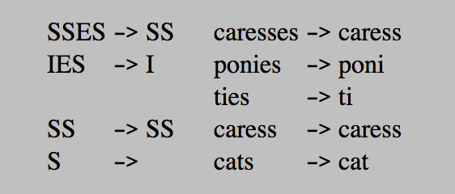
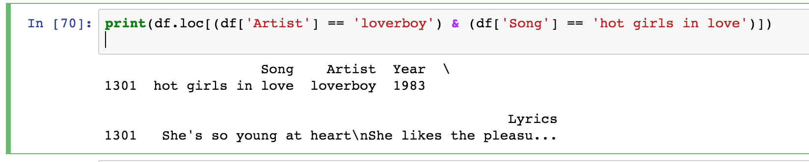

# Machine Learning Engineer Nanodegree
## Capstone Project
Samy Hajal  
December 3rd, 2017

## I. Definition

### Project Overview
#### Domain Background
Music has a big role in popular culture. It has been omnipresent in society and serves as a good representation of contemporary social interactions. It can also be used both as a depiction of the masses and as a driving force to social movements. On an individual level, listening to a song can partner with one's mood to drive oneself in a particular direction. It is shown that it can both regulate and induce different moods<sup>1</sup>.  
A major part of a song that is most directly related to by individuals is the lyrical theme of a song. Recent years have seen the rise of song recommendation engines by different music providers such as Pandora, Spotify and Soundcloud. These recommendation engines typically rely on a song's meta-information (artist, year released, genre) and the user behavior (time spent listening to a song, likes/dislikes/skips, users with similar taste)<sup>2</sup>. In order to connect with the listeners, a recommended piece needs to also be able to relate to ones mood. One way to fulfill that requirement is to address the lyrical theme of a song in order to provide a better understanding of its context and background.  

#### Dataset and Input Data
We will be using the `50 Years of Pop Music Lyrics` CSV dataset based on Billboard Magazine's Top 100 most popular songs. The dataset has been kindly built by @walkerkq and made available here: https://github.com/walkerkq/musiclyrics. A full description and samples of the dataset can be found here: https://www.kaggle.com/rakannimer/billboard-lyrics/data. In short, it contains songs ranked between 1 and 100 each year between 1965 and 2015 along with their lyrics. It also contains information about the song name and the artist. However, we will only be using the lyrics as it is what we are trying to solve in this problem; that is, the relationship between the lyrics and the release year. We will make the assumption that the 100 most popular songs for a certain year are a good representation of that release year.  
Here the is full list of columns:  
* __Rank__: The Billboard Magazine rank for that song in the corresponding year. Billboard has been keeping up with modern technologies to stay relevant with current trends and music platforms<sup>3</sup>. The rank is an integer between 1 and 100. Unused.
* __Song__: Song title. Unused. (Text)  
* __Artist__: Artist name. Unused. (Text)
* __Year__: Release year. Our target output. The year is an integer between 1 and 100.
* __Lyrics__: The song lyrics (Text). Our raw input.
* __Source__: Undocumented, unused.

##### _Dataset Augmentation_

After some exploration of the above dataset, it presented important structural flaws. For example, some words would be stuck to each other. In the context of vectorizing the data, this anomaly can have a great negative effect on the algorithm's outcome since 2 words put together will make a new unique word which could be misinterpreted by our vectorizer as a word of great significance.  
To counter this issue, I made the decision to re-scrape the entire dataset. Here are the steps I took:  
- I went through the original dataset to pick up from the artist name and song name of each data point.
- I setup a Google Custom Search engine to be able to search for song lyrics by inputting "{artist_name} + {song_name} + metrolyrics" to the API. I initially tried using azlyrics.com, but their API is rate limited.   https://stackoverflow.com/a/11206266  
- After getting the HTML load from metrolyrics, I parsed it using the BeautifulSoup package in Python.
- I filtered non-roman and numeric characters from the dataset.
- I merged the original dataset and my newly scraped dataset by filling in the lyrics feature with the original lyrics if my scraping algorithm was unsuccessful.

By doing so, I was able to get a cleaner dataset with a lower number of words stuck together.
Please refer to the attache files `google_search.py` and `merge_dataset.py` for the scraping and merging code.  

### Problem Statement
Given the importance of a song's lyrical theme as it relates to one's mood, we want to be able to predict a song's meta-information feature based on its lyrics. In this project, we will be focusing on approximating a song's release year in order to gain information and be able to better refine music recommendations. Therefore, we will be performing a regression on the dataset. After our model is trained, it will expect a song lyrics as input and will output a decimal number which represents our prediction of the release year of the input song.  

##### _Techniques_
We will be using NLP techniques such as Porter Stemming and TF-IDF vectorizing in order to structure the data. After reducing the dimension of our data by use of PCA, we will be feeding the vectorized data into a RandomForestRegressor and a neural network to predict the release year.

### Metrics
Since we are dealing with a regression that yields an output on a continuous range, we will be using the coefficient of determination, $R^2$, as a performance metrics for our algorithm. The score will help us evaluate how accurate our algorithm is at predicting that a song belongs to a certain year. We will be using 80% of our data points picked at random for training, and the remaining 20% as a testing set. Of the training set, we will be using 20% as validation data on each training pass to prevent overfitting.  
The coefficient of determination is defined as
$$R^{2} = 1 - {\sum_i(y_i-f_i)^{2} \over \sum_i(y_i-\bar{y})^{2}}$$
over the whole test data with $y_i$ as the true value of data point y, $f_i$ as the predicted value and $\bar{y}$ as the mean of the true values.  
An $R^2$ score of 1 perfectly predicts the true actual values. A value of 0 indicates that the model always returns the means as the predicted value. The $R^2$ can also take negative value if the model is performing poorly. It is a good use in our case since we are performing a regression and will be dealing with continuous values. One thing that the $R^2$ score fails to do is indicate whether the number of data points used is enough to make a robust model. For example, we could be training with 99% of our data and get a high $R^2$ score on our test data, but it does not mean that our model will generalize well.

## II. Analysis

### Data Exploration    

We are only using one raw feature of the dataset, but will transform it and vectorize it, as will be described in the following sections.
- The average number of words per lyrics is 339.86.
- Below are the artist with the most Top 100 songs between 1965 and 2015:
   

- Some records are affected by the 2 word stuck together issue that was brought up in the _Dataset Augmentation_ section above. Here is an example:  
_2,"i cant help myself sugar pie honey bunch","four tops",1965," sugar pie honey bunch you know that i love you i cant help myself i love you and nobody __elsein__ and out my life you come and you go leaving just your picture behind and i kissed it a thousand __timeswhen__ you snap your finger or wink your eye i come arunning to you im tied to your apron strings and theres nothing that i can __docant__ help myself no i cant help __myselfsugar__ pie honey bunch im weaker than a man should be i cant help myself im a fool in love you __seewanna__ tell you i dont love you tell you that were through and ive tried but every time i see your face i get all choked up __insidewhen__ i call your name girl it starts the flame burning in my heart tearing it all apart no matter how i try my love i cannot __hidecause__ sugar pie honey bunch you know that im weak for you cant help myself i love you and nobody __elsesugar__ pie honey bunch do anything you ask me to cant help myself i want you and nobody __elsesugar__ pie honey bunch you know that i love you i cant help myself i cant help myself ",1_  
The first field value is _2_, which is the data point number. The other fields are song name, artist, release year, lyrics and position on the billboard top 100 list. Since we made the assumption that all songs in a given year equally represent that year, we decided to only select the fields song name artist, release year and lyrics after re-scraping. The above data point then became:
```
i cant help myself sugar pie honey bunch,four tops,1965," Ooh, sugar pie, honey bunch
You know that I love you
I can't help myself
I love you and nobody else In and out my life [(In and out my life)]
You come and you go [(You come and you go)]
Leaving just your picture behind [(Ooh)]
And I've kissed it a thousand times [(Ooh)] When you snap your finger or wink your eye
I come a-running to you
I'm tied to your apron strings
And there's nothing that I can do, ooh I can't help myself
No, I can't help myself 'Cause sugar pie, honey bunch [(Sugar pie, honey bunch)]
I'm weaker than a man should be
I can't help myself
I'm a fool in love, you see Wanna tell you I don't love you
Tell you that we're through and I try
But every time I see your face [(Can't help myself)]
I get all choked up inside When I call your name
Girl, it starts to flame [(Burning in my heart, tearing it all apart)]
No matter how I try
My love I cannot hide 'Cause sugar pie, honey bunch [(Sugar pie, honey bunch)]
You know that I'm waiting for you [(Waiting for you)]
I can't help myself
I love you and nobody else, ooh Sugar pie, honey bunch [(Sugar pie, honey bunch)]
I'd do anything you ask me to [(Ask me to)]
I can't help myself
I want you and nobody else, ooh Sugar pie, honey bunch [(Sugar pie, honey bunch)]
You know that I love you [(Love you)]
I can't help myself
No, I can't help myself, ooh Sugar pie, honey bunch [(Sugar pie, honey bunch)]
You know that I love you"
```
- Some records had missing data. Our re-scraping script was able to retrieve data for some of the missing data points in the original dataset, but some records were left with no lyrics, and were then unusable. We ended up with 4988 data points with usable data, as opposed to 5100 in the original dataset, which means we had to throw away ~2% of the records. See example below:  
```
40,"passion","rythm syndicate",1991,NA,NA
```


### Exploratory Visualization
We suspect that the number of words in songs has been increasing over the years since the average length of pop songs has also been increasing in the past few decades. The graph below confirms our suspicions. The green line is an interpolation of the data points.  
```python
# Plot word count average per year
aggregations =
  {'Lyrics':lambda x: np.mean([len(r.replace('\n', ' ').split()) for r in x])}

word_count_avg_per_year = df_sorted.groupby('Year').agg(aggregations)
x = range(1965, 2016)

# Interpolate the function
f = interp1d(np.array(x),
np.array(word_count_avg_per_year).squeeze(), kind='cubic')
x_interp = np.linspace(1965, 2015, num=8, endpoint=True)

# Plot
plt.plot(x, word_count_avg_per_year, 'o',
  x_interp, f(x_interp), '-', color='green', markerfacecolor='blue', markersize=5)
plt.title("Word count average per year")
plt.show()
```
  
__  
We also make the assumption that the number of profanity words per song is going to increase on average over the years, especially since the rise of Hip-Hop in the early 90's, the tendency of society to move into a less conservative direction. This assumption turns out to be true as we see a tremendous increase of profane language since the early 90's.  
```python
# Compute profanity count average per year
aggregations = {
    'Lyrics': lambda year: np.mean([sum([r.replace('\n', ' ').lower()
      .translate(None, string.punctuation).split().count(p.lower())
      for p in profanityfilter.get_bad_words()]) for r in year])
}

# Compute aggregation (or load pickle object)
try:
    profanity_count_avg_per_year = pickle.load(open("pcapy.pickle", "rb"))
except (OSError, IOError) as e:
    profanity_count_avg_per_year = df_sorted.groupby('Year').agg(aggregations)
    pickle.dump(profanity_count_avg_per_year, open("pcapy.pickle", "wb"))

# Interpolate the function
f_prof = interp1d(np.array(x),
  np.array(profanity_count_avg_per_year).squeeze(), kind='cubic')
x_prof_interp = np.linspace(1965, 2015, num=9, endpoint=True)

# Plot profanity average per year
plt.plot(x, profanity_count_avg_per_year, 'o', x_prof_interp, f_prof(x_prof_interp),
  '-', color='green', markerfacecolor='blue', markersize=5)
plt.title("Average number of profanity words over the years")
plt.show()
```

  
--  
It is also interesting to look at how many new words enter the set of pop songs in a given year. The data we gathered does not exhibit a linear evolution with the desired output, i.e. the release year, but it does tell us that the pop music dictionary is constantly evolving from year to year, and acts as a good mirror to the vocabulary of people's conversations and language.  
```python
## Number of new words over the years
prev_year = set()
this_year = set()
year = '1965'
diffs = []
diffs.append([])
diffs.append([])
for row in df_sorted.iterrows():
    if year != row[1]['Year']:
        intersection = this_year.intersection(prev_year)
        diffs[0].append(len(this_year)-len(intersection))
        prev_year = prev_year.union(this_year)
        this_year = set()
        year = row[1]['Year']
    for w in row[1]['Lyrics'].split():
        this_year.add(w)

plt.plot(range(1966, 2016), diffs[0][1:])
plt.title("Number of new words over the years")
plt.show()
```


  
__  

After performing the tf-idf vectorization of our data, we find that the shape of our dataset is `(4988, 22637)`. This explained by the fact that we have 100 songs per year over the past 55 years, and we had to drop a few records (162 exactly) because of their missing data, which leaves us with 4988. The fact that each record has 22637 shows that, post-stemming, it shows that there are 22637 unique root words used in all the dataset.  


### Algorithms and Techniques
Here are the algorithms we used in this project:  
- PorterStemmer in order to reduce words to their root. It relies on a set of rules that transform word endings into common suffixes. Example of porter stemmer transformations:

- Aggregation technique on the `pandas` `DateFrame` in order to retrieve profanity words and word count.
- Principal Component Analysis in order to reduce dimensionality.
  - `PCA` is an orthogonal linear transformation of the dataset features into components such that the components are ordered from highest variance to lowest variance. This technique also informs us on how much variance is explained by any first $n$ components. That way, we can take advantage of the dimensionality-variance explained trade-off and lose some variance in order to reduce the dimension of our dataset, speed our computations and minimize overfitting.
- TF-IDF vectorization which computes the product of the term frequency of a certain word and the inverse document frequency of that word<sup>3</sup>.
- `RandomForestRegressor`:
  - This algorithm works by running the data through subsequent decision trees with a subset of the number of features, and averaging their predictions. This technique enables us to drastically reduce overfitting and maintaining a reasonable computing time. The good thing here is that the training of the decision trees can be parallelized by using the  `n_jobs` parameter.
  - Hyper-paramater tuning on number of estimators (trees), max depth of trees.
- `MLPRegressor` (Neural Network):
  - This `sklearn` class works like a neural network. We will be using an input layer, hidden layers and an output layer. The algorithm will sequentially feed-forward each training data point and then back-propagate in order to adjust the values of the weight matrices. The continuous output is given as the sum of the final hidden layer's weights multiplied by the input vector to that last hidden layer. The neural network is advantageous since we have inputs with a large feature set (multiple different words that have dependencies), and therefore the use of hidden layers will be able to highlight the relation between each feature. However, the model will require training time since the algorithm is computationally demanding.
  - Hyper-parameter tuning on number and size of hidden layers.
- The data will be made up of the vectorized lyrics post stemming processing, and will also include the number of profanity words as well as the word count.

We will be then be performing PCA on that dataset in order to get our X matrix, which will then be split into 80%  X_train and 20% X_test and fed into our regressors.

### Benchmark
We are given some extra information about the dataset. Songs length have been increasing since the 1960’s until today. We use this information to build a benchmark model that linearly predicts the release year based on the number of words in the song. We will be using `scitkit-learn`’s LinearRegression class that uses the Ordinary Least-Squares method. We will be feeding the number of words in the song lyrics as input and predicting the release year.

```python
### Benchmark Model

# Count the number of words in each song
word_counts = [len(row[1]['Lyrics'].replace('\n', ' ').split())
                  for row in df_sorted.iterrows()]
X_bench = np.array(word_counts).reshape((len(word_counts), 1))
y_bench = df_sorted['Year']

# Train test split for benchmark
X_train_b, X_test_b, y_train_b, y_test_b =
  train_test_split(X_bench, y_bench, test_size=0.2, random_state=1)

# Initiliaze and train the benchmar model
benchmark_model = LinearRegression()
benchmark_model.fit(X_train_b, y_train_b)

# Predict year using the benchmark and print r2 score
y_pred = benchmark_model.predict(X_test_b)
print('R2 score: {}'.format(r2_score(y_test_b, y_pred)))
```

    R2 score: 0.26493386708


## III. Methodology

### Data Preprocessing
#### _Text Preprocessing_
Each song lyrics is characterized by raw text data. In order to make some sense out of the text, we will be preprocessing the data in order to generate features for each data point that we can feed into the models we choose to train. To bring up the words in the text that are more defining to a certain song, there are a few approaches we can use.  
When it comes to the benchmark model, we simply counted the number of words in the corpus, by splitting on empty spaces. It generates one-feature data points that we  then performed linear regression on.  

In order to make more sense of the text, we processed the corpus with the Porter Stemming Algorithm<sup>4</sup> using the `nltk` Python module. This algorithm reduces words to their root (See _Algorithms and Techniques_ section for examples). This helps achieving 2 things. First, by reducing the words to their root, we reduce the dimension of the dataset (`cats` and `cat` will are both transformed to `cat`). Second, we maximize the connection between data points. In most cases, a word, whether it is singular or plural, past tense or present tense, holds the same theme and meaning.  
In addition to the stemming algorithm, we also removed `stop words` from the dataset since they don't add any meaningful value to a particular corpus. The full list of stop words is available here. <sup>5</sup>  
The third text processing we performed on the corpus it a TF-IDF vectorization. `scikit-learn` provides a `TfIdfVectorizer` that we used for this purpose. For each data point, the vectorizer yields a vector with length equal to the number of distinct words in all the song lyrics of our dataset.  

```python
### Vectorizing the data

stemmer = PorterStemmer()

def stem_tokens(tokens, stemmer):
    stemmed = []
    for item in tokens:
        stemmed.append(stemmer.stem(item))
    return stemmed

def tokenize(text):
    tokens = nltk.word_tokenize(text)
    tokens_filtered =
      filter(lambda w: not w in set(stopwords.words('english')), tokens)
    stems = stem_tokens(tokens_filtered, stemmer)
    return stems

result = []

for row in df.iterrows():
    text = row[1]['Lyrics']
    lowers = text.lower()
    no_punctuation = lowers.translate(None, string.punctuation)
    result.append(no_punctuation)

try:
    tfidf = pickle.load(open("tfidf.pickle", "rb"))
except (OSError, IOError) as e:
    tfidf = TfidfVectorizer(tokenizer=tokenize, stop_words='english',
      encoding='latin-1', binary=True, sublinear_tf=True)
    pickle.dump(tfidf, open("tfidf.pickle", "wb"))

try:
    tfs = pickle.load(open("tfs.pickle", "rb"))
except (OSError, IOError) as e:
    tfs = tfidf.fit_transform(result)
    pickle.dump(tfs, open("tfs.pickle", "wb"))
```


#### _Dimensionality Reduction_
In addition to the various text processing techniques we used to reduce dimension, we also performed PCA on the processed dataset in order to further reduce the dimensionality of our dataset. We performed PCA on the dataset and experimented with the `n_components` hyper-parameter and chose to reduce the dimension to 50. By looking at the `explained_variance_ratio_`, the first principal axis already explains `9.99962362e-01` of the dataset variance.  

### Implementation
#### _Scraping_
The re-scraping and merging of the dataset was performed with Python scripts ran locally on my machine. I faced some issues when it came to find a free lyrics API. I looked into `Musixmatch` but it was a costly solution. Therefore I decided to use Google's `Custom Search Engine` in order to send search queries (see `google_search.py` attached). I decided to retrieve the data from azlyrics.com, but it looked like my IP address got blacklisted after a few hundred queries. Therefore, I pivoted to use `metrolyrics` as my datasource. I ran into a few issues with string encoding since some lyrics had false data written in Russian or Mandarin. I decided to only keep words using `Latin` encodings. I ran multiple scripts that read different parts of the input dataset and wrote to different files in order to speed up the scraping. Running 2 different scripts took a total of *4 hours*. After that, I had to deal with merging the data in the different files and had to write my own merging logic in `merge_csv.py`. If lyrics were not found through my scraping, I would keep the data from the orginal dataset. In the end, I ended up with a re-scraped dataset written to `merged.csv`.  

#### _Training_
I  pre-processed the data inside `merged.csv` as outlined in the _Text Preprocessing_ section above.  
I then implemented the project using iPython notebook since it helped me take screenshots of my work as I was coding. I read the re-scraped CSV file into a `pandas` DataFrame. The initial DataFrame was transformed as it underwent pre-processing, dimension reduction, feature addition (word count and profanity count), train/test split and training.  
In order to get the profanity count, I simply counted the number of profanity words in the dataset as they appear in the `profanityfilter` python module.
As I was developing, some objects took a long time to process. Since I was doing multiple runs in order to test the training algorithms with different hyper-parameters and experimenting with the input data, I used the `pickle` module in order to save these objects to the filesystem, and load them on each new startup.  
The 2 new features added to the dataset after the TF-IDF vectorization are:
- The number of words in the song; since I found that there is a good correlation between the release year and the song length.
- The number of profanity words; music through the year has been moving from implicit references to profane themes, to explicit profanity.<sup>6</sup>  

```python
profanity_count = [sum([r.split().count(p.lower())
  for p in profanityfilter.get_bad_words()]) for r in result]
tfs_profanity = np.concatenate((np.array(profanity_exists)
  .reshape(len(profanity_exists), 1), tfs.toarray()), axis=1)
print('Dataset with profanity: {}\n'.format(tfs_profanity.shape))

word_count_per_dp = [len(r.replace('\n', ' ').split()) for r in df['Lyrics']]
tfs_profanity_wc = np.concatenate((np.array(word_count_per_dp)
  .reshape(len(word_count_per_dp), 1), tfs_profanity), axis=1)
print('Dataset with profanity and word count shape: {}\n'
  .format(tfs_profanity_wc.shape))
```

    Dataset with profanity: (4988, 22638)
    Dataset with profanity and word count shape: (4988, 22639)

In order to find the best estimator I performed grid search on a number of hyper parameters including:
- `RandomForestRegressor`: the number of estimators, the maximum depth and the maximum number of features.
- `MLPRegressor`: the number of hidden layers, the size of them and the maximum number of epochs  

I re-used parts of the `fit_model` function from the `boston-housing` project.  I started off with random ranges of values from projects I had worked on in the past. When I saw that the optimal model found selected a value in the middle of the given range, I deemed my results acceptable. For example, the best `max_iter` value for the `MLPRegressor` was 500 when the range passed in was `[100, 200, 500, 1000]` and the best `hidden_layer_sizes` was `(50,0)` when the range passed in was `[(10,), (50,), (100,), (50,10)]`. See the Results section below for full description of the best model generated.

```python
def fit_model(X, y, params):
    cv_sets =
      ShuffleSplit(X.shape[0], n_iter = 10, test_size = 0.20, random_state = 0)
    regressor =
      MLPRegressor(random_state=1, learning_rate='adaptive', alpha=0.00001)
    scoring_fnc = make_scorer(r2_score)

    grid =
      GridSearchCV(regressor, params, scoring=scoring_fnc, cv=cv_sets, verbose=2)
    grid = grid.fit(X, y)

    return grid.best_estimator_

best_model = fit_model(X_train, y_train,
  {'hidden_layer_sizes': [(10,), (50,), (100,), (50,10)],
    'max_iter':[100, 200, 500, 1000]})
```

### Refinement

- Re-scraping the dataset happened after initial exploration and was vital to the completion of this project.
- PCA was not in the original run but added great value and shorter computing time.
- Adding the number of words increased the score dramatically from 0.35 to 0.46.

## IV. Results
### Model Evaluation and Validation

- The benchmark model R<sup>2</sup> score is 0.26493386708.
- The best model we generated was a Multi-Layer Perceptron (Neural Network) which got a score of 0.46644313957765082 after performing grid search on a range of hyper-parameters. Its parameters are as follows:  
`MLPRegressor(activation='relu', alpha=1e-05, batch_size='auto', beta_1=0.9,  
       beta_2=0.999, early_stopping=False, epsilon=1e-08,  
       hidden_layer_sizes=(50,), learning_rate='adaptive',  
       learning_rate_init=0.001, max_iter=500, momentum=0.9,  
       nesterovs_momentum=True, power_t=0.5, random_state=1, shuffle=True,  
       solver='adam', tol=0.0001, validation_fraction=0.1, verbose=False,  
       warm_start=False)`

### Model Evaluation and Validation

I created the below function to predict the year of any given song lyrics inputted as a string variable. It rounds up the year to the nearest integer since we are performing a regression but are looking for an integer output.  

```python
def predict_year(lyrics):
  no_punctuation_result = lyrics.lower().translate(None, string.punctuation)
  tfidf_result = tfidf.transform([no_punctuation_result])

  profanity_count_result =
    sum([no_punctuation_result.split().count(p.lower())
      for p in profanityfilter.get_bad_words()])
  word_count_result = len(lyrics.replace('\n', ' ').split())
  tfs_profanity_result =
    np.concatenate((np.array(profanity_count_result).reshape(1, 1),
      tfidf_result.toarray()), axis=1)
  tfs_profanity_wc_result =
    np.concatenate((np.array(word_count_result).reshape(1, 1),
      tfs_profanity_result), axis=1)

  post_pca = pca.transform(tfs_profanity_wc_result)
  return int(best_model.predict(post_pca)[0]) + 1965
```

When I tested it on new data, I got the following results (the lyrics have been omitted but they are widely available on the Internet). The variables represent {artist}\_{song}\_{true_release_year}.

```
Post Malone - Rockstar - 2017. Predicted: 1994
Ella Fitzgerald - Summertime - 1968. Predicted: 1973
Childish Gambino - Crawl - 2013. Predicted: 1983
Ed Sheeran - A team - 2011. Predicted: 2000
James Blake - Retrograde - 2013. Predicted: 1983
The Police - Message in a Bottle - 1979. Predicted: 1981
```

- *Rockstar* seems very off. It could be due to it being a Rap song and Rap being prominent in the early 1990's.  
- *Summertime* looks like a good prediction due to the fact that it contains simple and repeating lyrics, which is common in early pop songs.
- *Crawl* by Childish Gambino is off-target by 20 years which is almost half of the dataset release year range.
- Ed Sheeran's *A-team* gets an "okay" prediction, but still 20% off compared to the 50 years range of our dataset.
- *Retrograde* is also off. The lyrics theme here is very general and does not contain any indication of its timeframe.
- The Police's *Message in a Bottle* gets a good prediction with only 2 years off. It is interesting to look at the similarities between this song and James Blake's *Retrograde*. They both address the same themes of despair and general sadness, which explains their similar predicted year.

The model seems fairly robust but could behave unexpectedly for some data points. For the few examples I have presented above, I would see someone using this model in order to supplement a song recommendation engine. However, if the application were more critical, like applications in the medical or defense field, such average robustness would probably make the model unusable.

I realize that the R<sup>2</sup> for our best model is not overwhelming but it is definitely an improvement over the benchmark, and serves to show that the link between a song's lyrical theme and the historical context in which it was released is definitely existent. There are obviously other factors that affect a song's theme, like its geographical location as well as the background and profile of the artist behind the given song.


## V. Conclusion

### Free-Form Visualization
I decided to show the underlying data of the TfIdfVectorizer object that I fit to the data. This class allows me to access the feature names through the `get_feature_names()` method, which, in our case, are the the stemmed words of our data. Here is a sample list of stemmed words.

```python
tfidf.get_feature_names()[1012:1032]
```
```
[u'anniversari',
 u'annnnn',
 u'announc',
 u'annoy',
 u'annoyin',
 u'anoanoanoth',
 u'anoint',
 u'anonym',
 u'anorex',
 u'anoth',
 u'anotha',
 u'anotheral',
 u'anothin',
 u'ansiedad',
 u'answer',
 u'answerphon',
 u'ant',
 u'antediluvian',
 u'antelop',
 u'antenna']
```  

If we take a look at the stemmed word `anniversari` which is the 1013th feature, we see that the song `hot girls in love` by `loverboy` contains the word `anniversary`, which, after going through the stemming algorithm, becomes `anniversari`. Looking at the above data point, we determine that it is the 1302th data point in the `pandas` dataframe.



If we then look at the value of the element at row 1301 and column 1012 of the dataset (zero-based indexing), we find the value `0.231317409355` which is the `tdidf("anniversari", hot girls love by loverboy )`

--

Another interesting visualization is the most common words in each decade of our dataset, which will give us a better sense of the lyrical themes over the years:
```python
from collections import Counter
wcounters = [Counter()]
curr_decade = 1965
stopws = set(stopwords.words('english'))
stopws.add("i'm")
stopws.add('like')
stopws.add("can't")
stopws.add("it's")

tokens_per_song = [(row[1]['Year'], row[1]['Lyrics'].replace('\n', ' ').split())
  for row in df_sorted.iterrows()]
decade_count = 0
for song in tokens_per_song:
    year = int(song[0])
    lyrics = song[1]
    if (year - curr_decade) == 10 and year != 2015:
        decade_count += 1
        wcounters.append(Counter())
        curr_decade = year
    for w in lyrics:
        w = w.lower()
        if w not in stopws:
            wcounters[decade_count][w] += 1


curr_decade = 1965
for wcounter in wcounters:
    print
    print(curr_decade)
    curr_decade += 10
    for common in wcounter.most_common(10):
        print(common[0] + " - " + str(common[1]) + " occurrences")
```

```
1965
love - 2267 occurrences
baby - 1169 occurrences
know - 1102 occurrences
got - 1046 occurrences
don't - 997 occurrences
get - 949 occurrences
oh - 828 occurrences
come - 793 occurrences
let - 757 occurrences
time - 686 occurrences

1975
love - 3051 occurrences
know - 1529 occurrences
don't - 1451 occurrences
got - 1243 occurrences
get - 1140 occurrences
time - 1082 occurrences
you're - 1079 occurrences
baby - 981 occurrences
want - 947 occurrences
oh - 940 occurrences

1985
love - 3603 occurrences
don't - 2198 occurrences
know - 2186 occurrences
baby - 1588 occurrences
got - 1402 occurrences
oh - 1380 occurrences
get - 1351 occurrences
want - 1273 occurrences
make - 1195 occurrences
go - 1150 occurrences

1995
know - 2976 occurrences
love - 2880 occurrences
don't - 2569 occurrences
get - 2258 occurrences
got - 1951 occurrences
baby - 1871 occurrences
wanna - 1746 occurrences
want - 1572 occurrences
make - 1468 occurrences
you're - 1378 occurrences

2005
know - 3320 occurrences
don't - 3150 occurrences
got - 2995 occurrences
love - 2816 occurrences
get - 2712 occurrences
oh - 2195 occurrences
go - 1917 occurrences
make - 1791 occurrences
wanna - 1788 occurrences
you're - 1767 occurrences
```

As expected in pop music, the recurring theme is "love", which is a genuine way for our model to make explicit the universal meaning of love.


### Reflection
I faced a major blocker when I realized that the dataset was not clean and had major errors. I contemplated starting with a new project but decided to try to scrape the data again. I did spend a considerable amount of time and effort on this task but it turned out to be an interesting and rewarding task and helped me counter this issue.
The first challenge I found while developing this project was generating the dataset. Since I was starting with 1 raw feature per dataset, there were many options for the features that I wanted to generate. I made some assumptions about what would make good features, and after some research, decided to use a stemming algorithm and vectorize the corpus with the TF-IDF features. However, I could have chosen to analyze the structure of the corpus, use the number of verses/choruses and the number of featured artist in the song. I could have performed sentiment analysis to process the lyrics in order get a better feel for spectrum of emotions in a particular song. All of this to show that there are many ways to go about a raw dataset, and I was glad I got the chance to explore these options and turn the data into a set of multi-features vectors that can be fed into a regressor.

I realized that lyrics only are not able to give enough information to accurately determine the historical context of a song. Most themes in pop music have been recurrent over the years which leads us to the conclusion that even though society has evolved over the decades, people are still drawn to similar topics and are affected by the same issues. Another explanation comes from the own definition of pop music. It is a kind of music that attracts the largest group of people, and in order to do so, needs to be as versatile and broad as possible. Therefore, not a lot of context and temporal indications are given in pop songs in order to reach a broader audience, hence the complications of determining the era which a song belongs to.  

### Improvement
Using additional features would have definitely helped in approximating the release year of a song.
For example, the musical genre will definitely help improve the results since a genre is very representative of a certain era. Also, if we would want to keep predicting release years for modern songs, we would have to show our algorithm newer data points in order for it to be able to predict a wider year range.

## VI. References

<sup>1</sup> Psychology Today, January 19, 2016. Music’s Power Explained. Retrieved from https://www.psychologytoday.com/blog/the-truisms-wellness/201601/music-s-power-explained  
<sup>2</sup> SlideShare, January 25, 2013. Collaborative Filtering at Spotify. https://www.slideshare.net/erikbern/collaborative-filtering-at-spotify-16182818  
<sup>3</sup> Wikipedia. Billboard Hot 100. https://en.wikipedia.org/wiki/Billboard_Hot_100#Hot_100_policy_changes  
<sup>4</sup> Computer Science Duke University. January 1, 2014. Document Similarity using NLTK and Scikit-Learn. http://www.cs.duke.edu/courses/spring14/compsci290/assignments/lab02.html  
<sup>5</sup> Pythonspot.com. NLTK stop words. https://pythonspot.com/en/nltk-stop-words  
<sup>6</sup> Slate.com. June 27, 2016. When Lyrics Were Clean, Almost.  http://www.slate.com/blogs/lexicon_valley/2016/06/27/a_history_of_swearing_in_music.html
